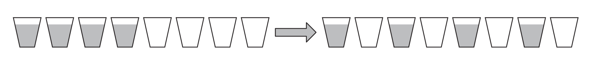
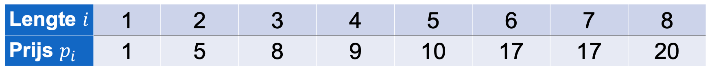

# Algoritmen

Sommige oefeningen van de theorielessen algoritmen in c++ uitgeschreven met tests.

# To do

## Top down

Veronderstel een rij van *n* gevulde glazen, gevolgd door *n* lege glazen.
Ontwerp een algoritme om in zo weinig mogelijk stappen een alternerend patroon te krijgen.

## Bottom-up

Je hebt de resultaten van een competitie waarinnteams elk 1 keer tegen alle andere teams hebben gespeeld.
Ontwerp een algoritme om te teams te plaatsen in een sequentie waarbij elk team niet verloren heeft tegen het team dat onmiddellijk daarna in de lijst staat.
Wat is de tijdsefficiëntie van je algoritme?

## Cut rod

Gegeven de prijzen p~i~ vo een staaf met lengte i?
Wat is de maximale omzet r~i~ die je kan halen uit een staaf met lengte i?
In welke stukken moeten we de staaf daarvoor snijden?

## Klavier

Veronderstel dat je een klavier hebt waarvan alle toetsen op1rij staan. De 26 meest linkse karakters zijn de letters A-Z, gevolgd door de cijfers 0-9, gevolgd door de punctuatiekarakters. De laatste toets is een spatie. Je start met je linkse wijsvinger op de meest linkse toets (letter A), en met je rechtse wijsvinger op de meest rechtste toets (spatie). 

Ontwerp met dynamisch programmeren een algoritme dat de meest efficiënte manier vindt om een gegeven tekst van **n** karakters te typen. Dit is de manier die de totale afstand afgelegd door beide wijsvingers minimaliseert.